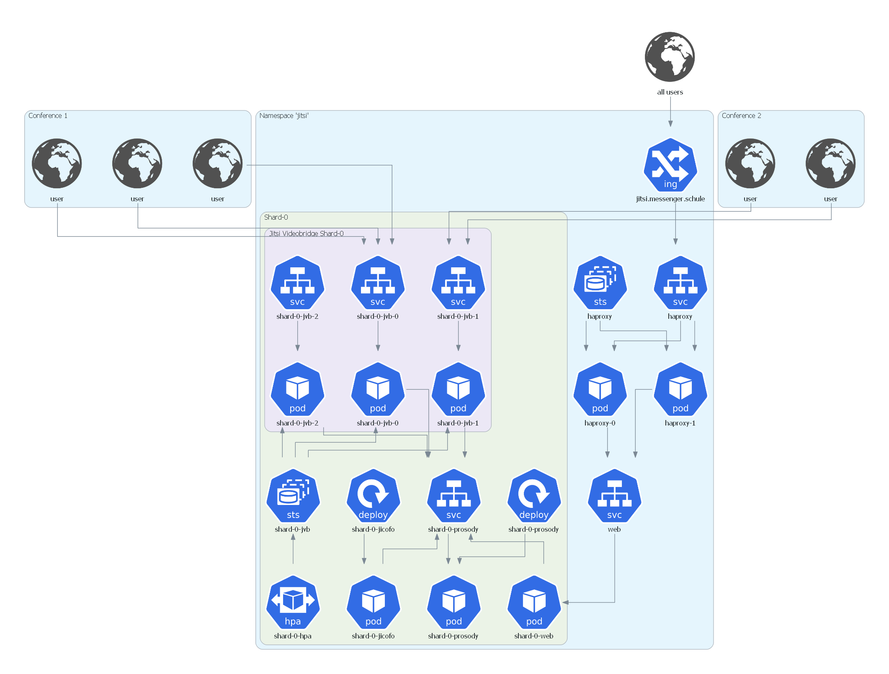

# Jitsi Meet

Scalable video conferencing on Kubernetes.

## Structure

The whole setup is based on Kubernetes YAML files and patches for these files.
It makes use of [kustomize](https://github.com/kubernetes-sigs/kustomize) to customize the raw YAMLs for each environment.

(Almost) every directory in the directory tree (depicted below) contains a `kustomize.yaml` file which defines resources (and possibly patches).

```
|-- base
|   |-- jitsi
|   |-- jitsi-shard
|   |   `-- jvb
|   `-- ops
|       |-- cert-manager
|       |-- dashboard
|       |-- ingress-nginx
|       |-- loadbalancer
|       |-- logging
|       |-- metacontroller
|       |-- monitoring
|       `-- reflector
`-- overlays
    |-- development
    |   |-- jitsi-base
    |   |-- ops
    |   |-- shard-0
    |   `-- shard-1
    `-- production
        |-- jitsi-base
        |-- ops
        |-- shard-0
        `-- shard-1
```

## Requirements

- [kubectl/v1.17.2+](https://kubernetes.io/docs/tasks/tools/install-kubectl/)
- [kustomize/v3.5.4](https://github.com/kubernetes-sigs/kustomize/releases/tag/kustomize%2Fv3.5.4)
  _WARNING_: newer versions of kustomize currently don't work due to changes regarding remote sources

## Install

To install the full setup go to either [`overlays/development`](overlays/development) or
[`overlays/production`](overlays/production) and run

```bash
$ kustomize build . | kubectl apply -f -
```
This deploys a Jitsi setup consisting of two shards. A shard is a complete replica of a Jitsi setup that is used in
parallel to other shards to load-balance and for high availability. More shards can be added following the documentation
in [`docs/architecture/architecture.md`](docs/architecture/architecture.md). The setup was tested against a managed
Kubernetes cluster (v1.17.2) running on [IONOS Cloud](https://dcd.ionos.com/).

## Architecture

The Jitsi Kubernetes namespace has the following architecture:



The setup shown above contains only a single shard (for visual clarity). Subsequent shards would be attached to the web
service. A more detailed explanation of the system architecture with multiple shards can be found in [docs/architecture/architecture.md](docs/architecture/architecture.md).

## Load Testing

Load testing is based on [jitsi-meet-torture](https://github.com/jitsi/jitsi-meet-torture) which is a Java application
that connects to a Jitsi instance as a user and shows a predefined video along with an audio stream by using a Selenium
Chrome instance. To run multiple test users in multiple conferences a Selenium hub set up with docker-compose is used.

Terraform scripts that set up the test servers with an existing image can be found under [`loadtest`](loadtest).
An [init script](loadtest/init.sh) is used to provision the necessary tools to that image. This image also needs SSH
access set up with public key authentication.

After starting a number of load test servers, the load test can be started by using the [`loadtest/run_loadtest.sh`](loadtest/run_loadtest.sh)
script (locally). Results can be found in [`docs/loadtests/loadtestresults.md`](docs/loadtests/loadtestresults.md).

## Kubernetes Dashboard Access

To access the installed [Kubernetes Dashboard](https://github.com/kubernetes/dashboard) execute
```bash
$ kubectl proxy
```
and then go to `http://localhost:8001/api/v1/namespaces/kubernetes-dashboard/services/https:kubernetes-dashboard:/proxy/`.

The login token can be received by executing
```bash
kubectl -n kubernetes-dashboard describe secret $(kubectl -n kubernetes-dashboard get secret | grep admin-user | awk '{print $1}')
```

## Kibana Access

Kibana is not accessible from the Internet and must be forwarded to your local machine via `kubectl` by executing
```bash
$ kubectl port-forward -n logging svc/kibana-kb-http 5601:5601
```
After that you will be able to access Kibana via [https://localhost:5601/](https://localhost:5601/).
The default login password (user `elastic`) can be received with
```bash
$ kubectl get secret -n logging elasticsearch-es-elastic-user -o=jsonpath='{.data.elastic}' | base64 --decode; echo
```

The same procedure can be used to access Prometheus or Alertmanager.

## Relationship With Other Projects

The monitoring stack that is set up by this project is currently also used by an [affiliated project](https://github.com/schul-cloud/bbb-deployment)
for [Big Blue Button](https://bigbluebutton.org/). Therefore, some of the files here contain configurations to monitor
that setup. To exclude them delete all files starting with `bbb-` and remove the file names from the respective
`kustomization.yaml` files.